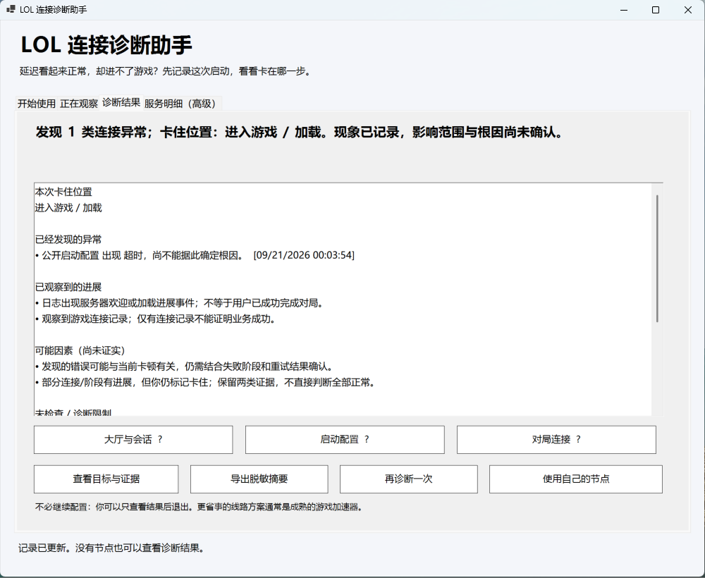

# LoL Connect

A Windows tool for diagnosing League of Legends connection failures and configuring service-specific routes with your own proxies.

[简体中文](README.md) · [Download](https://github.com/EasonSitu/lol-connect/releases/latest)

Built after encountering a recurring problem when connecting to mainland China LoL servers from Hong Kong: latency looked normal, but the client could not reach the lobby or finish loading.

LoL Connect observes a game launch, extracts connection evidence from accessible logs and local connections, and combines it with the stage where the user reports getting stuck. Optional routing controls help test user-supplied proxies and assign routes to individual services through Mihomo.

The interface is currently in Simplified Chinese. The screenshot shows one local diagnostic session, not a benchmark or proof of a resolved root cause.

## Usage

Install PowerShell 7.2+, extract the Windows release, and launch `LolConnect.exe`. Start a diagnosis, open the game normally, mark the stage where it stalls, and view the report. No proxy, Python or Clash installation is required for passive diagnosis.

Active probes require Python 3.9+ and curl. Proxy testing and routing require an existing Clash Verge/Mihomo setup. No proxies, subscriptions or relay servers are supplied. The EXE is a launcher, not a standalone bundled runtime.

## Scope

- Incremental log observations and user stage markers.
- Separate TLS, unauthenticated service response and complete configuration download results.
- Optional service-group and per-target routing, preview and restore.
- Local data storage and allowlisted diagnostic summary exports.

The three service groups represent lobby/session services, startup configuration and match traffic—not three fixed IP addresses. Templates cover a limited observed mainland China setup and require confirmation elsewhere. Successful probes do not prove successful authentication or gameplay. UDP capability declarations are not end-to-end gameplay tests.

Built and maintained by [Eason Situ](https://github.com/EasonSitu) with AI-assisted development. Independent personal project; no affiliation with Riot Games, Tencent or the named networking tools. [MIT licensed](LICENSE).
