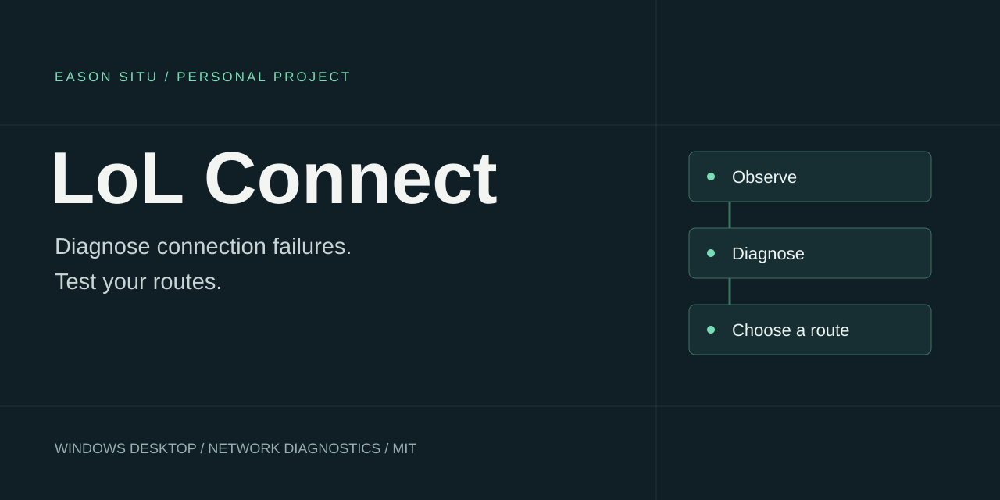
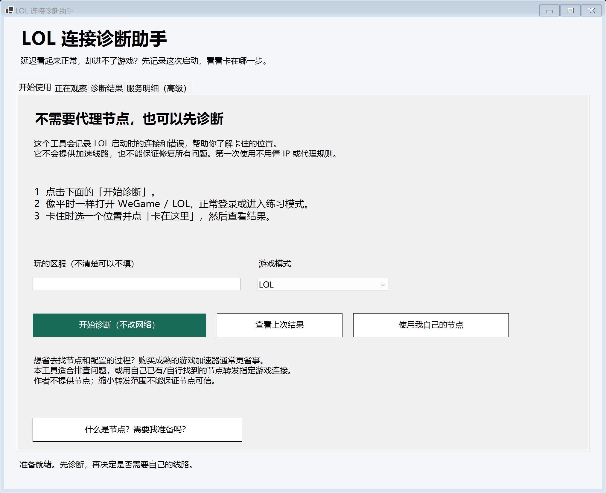
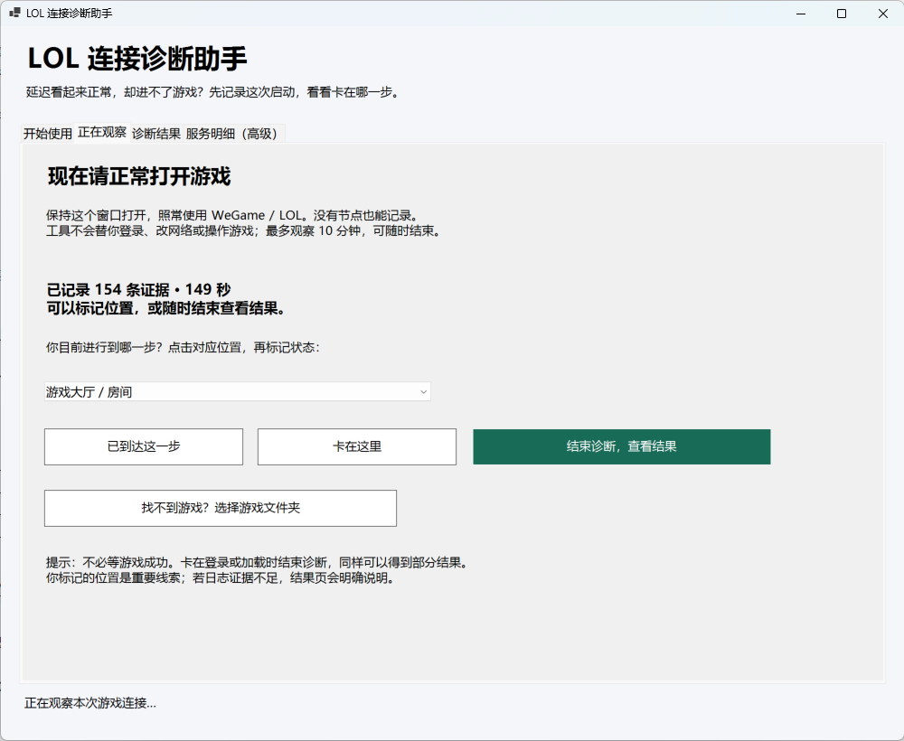

# LoL Connect

**面向国服 LOL 的 Windows 连接诊断与分流工具。记录启动过程中的连接异常，测试游戏服务，并通过图形界面配置自己的线路。**

[下载 Windows 版](https://github.com/EasonSitu/lol-connect/releases/latest) · [使用指南](docs/USAGE.zh-CN.md) · [English](README.en.md) · [实现说明](docs/ARCHITECTURE.md)

Windows 10/11 · PowerShell 7.2+ · MIT

## 为什么做这个

我在香港玩国服 LOL 时遇到过一个问题：WeGame 显示延迟正常，游戏却进不了大厅，或者一直停在加载画面。换一条线路有时能解决，但单看延迟，很难知道究竟是哪一段连接出了问题。

LoL Connect 从这次排查中做出来。它记录游戏启动时的连接和日志，把用户标记的卡住位置与观察到的异常放在一起；需要换线路时，再测试自己的节点，为不同服务选择路径。

它不提供节点或加速专线。无需代理节点，也可以先完成一次诊断。

## 实际界面

*一次本机排查的结果：观察到公开启动配置超时，同时有加载进展。工具保留两类证据，不据此断言根因或游戏已经可玩。截图不是性能基准。*

查看启动引导与观察过程

## 能做什么

- **记录一次启动**：增量读取可访问的游戏日志，观察相关连接，让用户标记“已到达”或“卡在这里”。
- **解释诊断结果**：分别展示异常、已有进展、可能因素和未检查项；证据不足时明确说明。
- **测试具体服务**：区分 TLS、无认证响应、配置完整下载与实际游戏体验，避免把一次响应当作全程可用。
- **管理自己的线路**：批量测试已有节点，在下拉列表查看结果，按服务组或单个目标分配路径。
- **预览与恢复分流**：应用前展示转发清单，通过 Clash/Mihomo 接管指定规则，并保留恢复入口。

## 三组服务，不是三个 IP

| 分组 | 对应内容 | 不能据此证明 |
|---|---|---|
| 大厅与会话 | 大厅、房间、授权和聊天等服务 | 某个接口有响应，不等于账号登录成功 |
| 启动配置 | 启动时读取的公开配置 | 配置下载完成，不等于所有资源和游戏流程正常 |
| 对局连接 | 实际游戏实时数据，主要关注 UDP | 节点声明支持 UDP，不等于对局可用 |

每组可以有多个目标，服务也可能同时连接。内置目标是有限的历史模板；不同区服、模式和版本需要重新识别及确认。

## 开始使用

1. 安装 [PowerShell 7](https://github.com/PowerShell/PowerShell/releases)，下载并完整解压 Windows 使用包。
2. 双击 `LolConnect.exe`，点击 **开始诊断（不改网络）**。
3. 正常打开 WeGame / LOL；卡住时回到工具标记位置。
4. 点击 **结束诊断，查看结果**。只有需要比较线路时，才进入 **使用我自己的节点**。

基础诊断不需要 Clash 或 Python。主动接口探测需要 Python 3.9+ 和系统 curl；节点测试与分流需要已有的 Clash Verge/Mihomo。EXE 是轻量启动入口，需要与脚本放在同一文件夹中。

## 设计取舍

**先诊断，再考虑线路。** 没有节点的用户也能看结果，不必先理解 IP、协议和代理规则。

**连接证据与游戏结果分开。** TLS、HTTP、完整下载和真实对局是不同层级。聊天失败不能直接判定整个游戏不可用；所有探测通过，也仍需打开游戏确认。

**只管理用户自己的节点。** 按目标分流可以缩小转发范围，但不能让不可信节点变安全，也不能按地址区分同一服务内的公开与授权请求。

如果只希望省去找线路和维护配置，成熟游戏加速器通常更省事。

## 实现与验证

界面使用 PowerShell / WinForms，探测器使用 Python 和 curl，分流通过本机 Mihomo 控制接口完成，C# 提供 EXE 启动器。用户数据保存在本地，不自动上传；分享摘要采用字段白名单，不附原始日志、节点或本机路径。

仓库包含日志增量读取、诊断结论、路由匹配、节点管理及探测器测试，以及不启用 TUN 的独立核心测试。运行方法与验证边界见 [实现说明](docs/ARCHITECTURE.md)。

目前是从个人使用场景整理出的 Windows 工具，并未覆盖所有国服区服、客户端版本或网络环境。受日志格式、权限和进程可见性影响，部分目标可能无法识别；UDP 与真实游戏流程仍需实际验收。

## 关于项目

由 [Eason Situ](https://github.com/EasonSitu) 发起并维护，使用 AI 辅助开发，从实际问题排查逐步形成诊断流程和桌面工具。项目重点是把网络排查证据、用户操作与可回退的配置过程连起来。

采用 [MIT License](LICENSE)。本项目为独立个人项目，与 Riot Games、腾讯、WeGame 及 Clash/Mihomo 无隶属或背书关系；相关名称用于说明兼容场景。
