# LoL Connect 图文使用手册

适用版本：v0.1.0 · 文档更新：2026-09-21

LoL Connect 用于观察国服 LOL 的启动连接、解释异常，并按需测试和配置用户自己的线路。没有节点也可以先诊断；节点测试和分流属于可选功能。

本手册按实际操作顺序编排。新增截图来自实际程序界面，窗口标题带“说明书示例”；其中的示例节点、地址和成绩只用于说明操作，不是可用线路或性能数据。

## 先记住这四步

**打开工具 → 开始诊断 → 正常开游戏，标记卡住位置 → 结束诊断，看结果。**

只有希望尝试其他线路时，才继续到节点管理和分流部分。第一次使用不用填写 IP。

| 你现在想做什么 | 去哪里 |
|---|---|
| 不知道游戏为什么卡住 | 开始使用 → 开始诊断 |
| 告诉工具卡在哪个画面 | 正在观察 → 选择阶段 → 卡在这里 |
| 看发现了什么、还缺什么证据 | 诊断结果 |
| 看本次找到的游戏服务器 | 服务明细（高级） |
| 添加自己的中转服务 | 使用我自己的节点 → 节点管理 |
| 比较已有线路 | 线路试验台 → 一键测试全部 / 各组下拉列表 |
| 给个别服务换一条路径 | 线路试验台 → 单独分配 |
| 撤销工具应用的分流 | 线路试验台 → 恢复接管前配置 |

## 01 · 启动与首次使用

完整解压 Windows 使用包，双击 `LolConnect.exe`。它需要与同目录的脚本一起使用；不要只复制 EXE。也可使用 `Start.cmd`。如果双击 `.ps1` 打开了记事本，请改用上述入口。

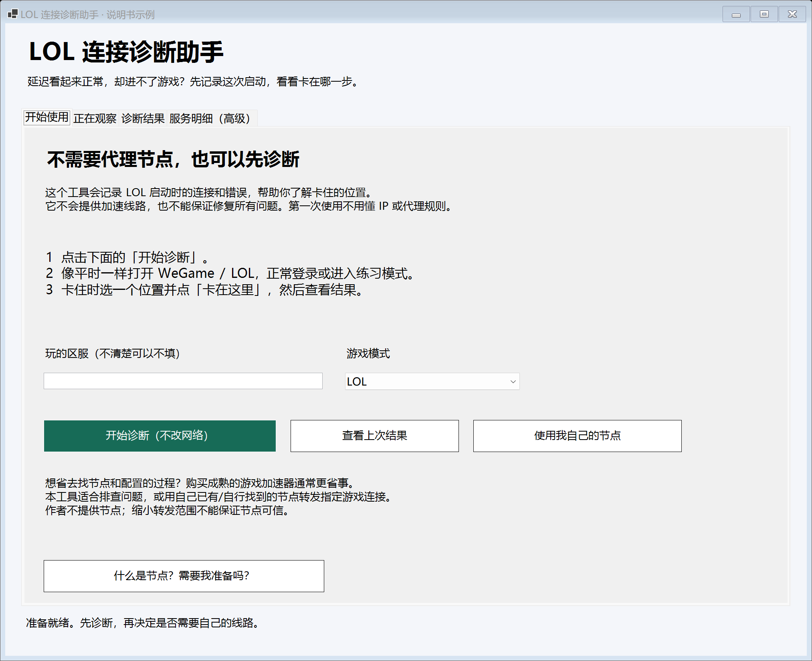

| 控件 | 怎么使用 |
|---|---|
| 玩的区服 | 可填写区服用于记录，不清楚可以留空；填写不会自动切换游戏区服 |
| 游戏模式 | 选择 LOL、云顶之弈或暂不清楚 |
| 开始诊断（不改网络） | 创建本次观察记录，随后正常打开游戏 |
| 查看上次结果 | 读取最近一次保存的诊断；不是重新测试 |
| 使用我自己的节点 | 打开高级线路窗口，不会仅因打开窗口就应用分流 |
| 什么是节点？ | 查看节点与诊断的关系说明 |

基础诊断需要 Windows 10/11 和 PowerShell 7.2+，不要求 Python、Clash 或代理节点。工具不会为了诊断关闭已有 VPN，所以这里观察的是你当前实际使用的网络。

## 02 · 观察过程与阶段标记

点击“开始诊断”后，切回 WeGame / LOL 正常操作。返回工具，在下拉框选择当前阶段。

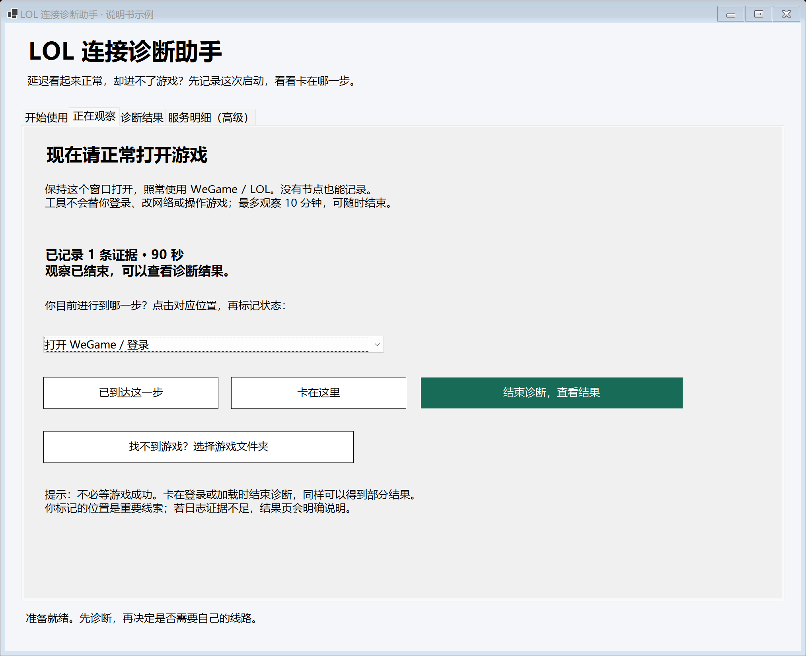

**已到达这一步**用于记录进展；**卡在这里**用于记录问题位置。先选对阶段，再点按钮。例如大厅能打开但加载一直转圈，选择“进入游戏 / 加载画面”，不要标成登录失败。

**结束诊断，查看结果**会结束采集并进入结果页。不需要等游戏成功；卡住时同样可以结束。单次观察最多十分钟。

**找不到游戏？选择游戏文件夹**用于补充可读取的日志位置。选择游戏安装目录或包含日志的文件夹；这不会修复游戏文件。证据数量只代表记录数量，不代表已经找到相同数量的问题。

## 03 · 阅读诊断结果

先读页面顶部，再向下滚动查看完整报告。

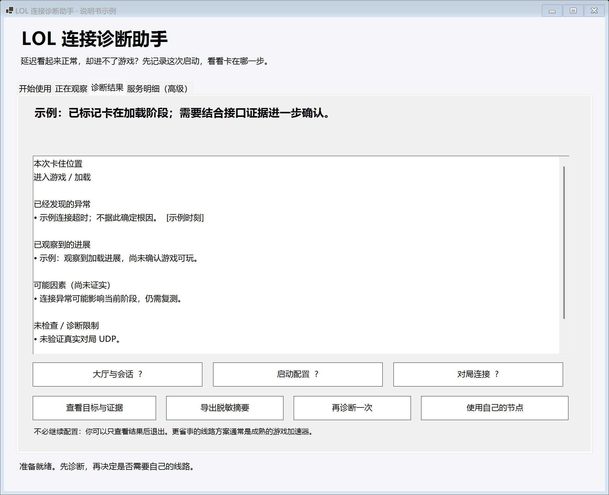

| 报告部分 | 应当怎样理解 |
|---|---|
| 卡住位置 | 主要来自你标记的阶段 |
| 已经发现的异常 | 观察到的超时、连接错误或探测失败；未必就是根因 |
| 已观察到的进展 | 日志、连接或你的阶段标记；与异常可以同时存在 |
| 可能因素 | 尚未证实的解释，不是修复结论 |
| 未检查 / 诊断限制 | 例如账号授权、真实对局 UDP 或不可读日志 |
| 下一步 | 继续观察、确认目标或按需比较线路 |

“证据不足”是有效结果，不等于全部正常。测试通过后仍卡住，也不矛盾：接口探测和完整游戏流程不是同一项检查。

页面下方的三个 **?** 按钮解释大厅与会话、启动配置、对局连接的范围。这是用途分组，不是三个固定 IP；服务可能同时连接。

**再诊断一次**用于下一轮启动；**导出脱敏摘要**生成本地 JSON 文件，并显示导出路径。摘要不含节点、原始日志或本机日志路径；它不是完整会话备份。

## 04 · 确认游戏目标

从结果页点击 **查看目标与证据**，进入“服务明细（高级）”。不需要调整线路时，可以跳过。

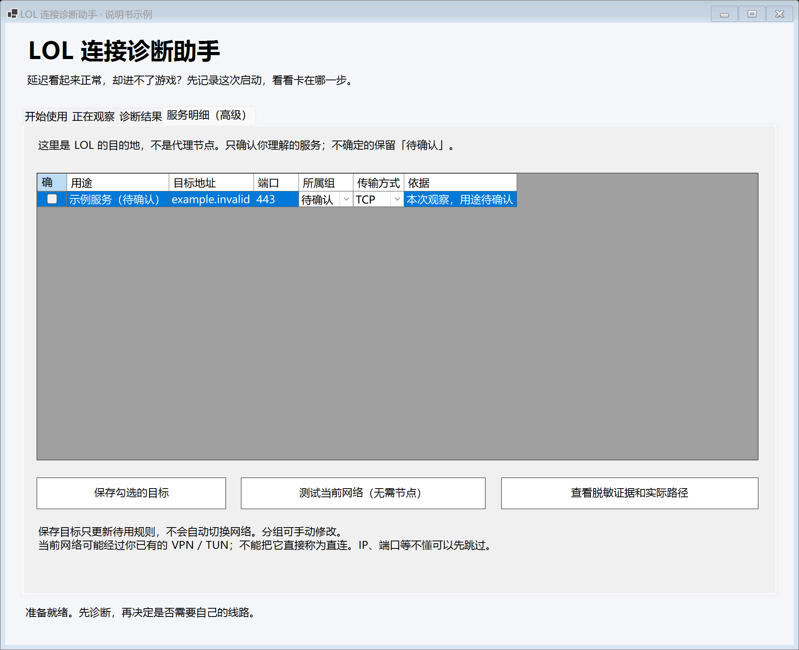

这里的地址是 **LOL 要连接的目的地**，不是你的代理节点。先核对用途、所属组和 TCP/UDP；未知用途或 `UNKNOWN` 协议的记录不要随意确认。

勾选目标并确认分组和协议后，点 **保存勾选的目标**。这会用所选目标更新待用目标集，不是单纯收藏，也不会自动切换网络。保存前检查是否漏选仍需要的目标。

**测试当前网络（无需节点）**会探测已确认、可测试的 TCP 服务，需要 Python。当前路径可能仍经过已有 VPN/TUN，因此结果不能自动称为“直连测试”。

## 05 · 查看证据与实际路径

在服务明细点击 **查看脱敏证据和实际路径**。

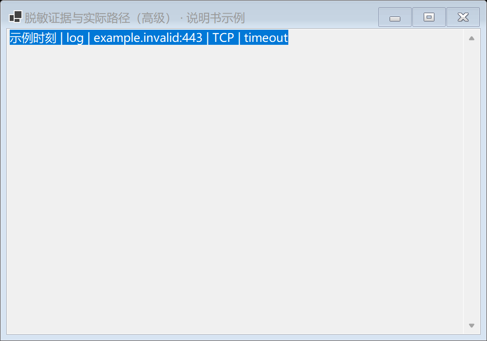

记录包括观察时间、来源、目标地址、传输方式和信号。例如 `log` 是日志来源，`connection` 是连接记录，`timeout` 表示超时线索。

应用分流并重新建立游戏连接后，这里还可能列出预期路径、观察代理链、命中规则和核验结果。没有新连接、无法识别游戏进程、连接早于应用，或当前配置无法确认时，不能据此判断分流已生效。

此窗口虽然不含原始日志，仍可能展示目标地址和代理链；分享前请检查。需要公开反馈时优先使用“导出脱敏摘要”。

## 06 · 线路试验台总览

首页或结果页点击 **使用我自己的节点**，会打开第二个窗口。

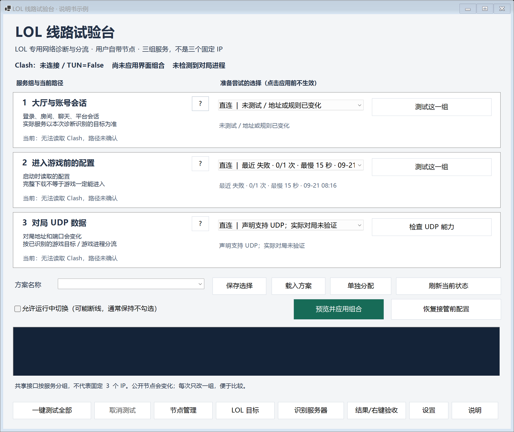

左侧显示当前状态，右侧下拉框是 **准备尝试的选择**。选中某个节点不会立即改路由。顶部提示 Clash 未连接时，当前路径尚未确认。

三组分别控制大厅与会话、启动配置、对局 UDP。组内目标也可单独分配。对局组的“检查 UDP 能力”只检查能力声明，不等于已经完成对局通信测试。

底部是节点管理、目标编辑、识别服务器、详细结果和设置入口。**刷新当前状态**重新读取状态，不等于重新测试所有节点。

## 07 · 管理自己的节点

在高级窗口点击 **节点管理**。顶部可按名称、地址或协议搜索。

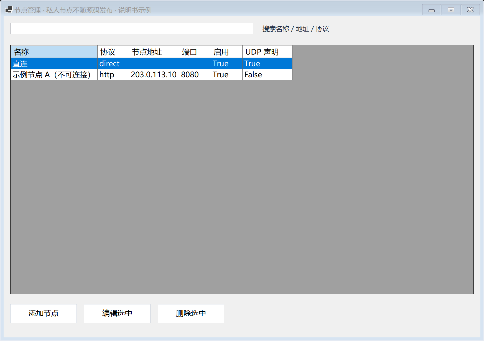

**添加节点**创建本地记录；选中一行后可 **编辑选中** 或 **删除选中**。把“启用”改成 `false` 可以停用本地节点。直连和已有 Clash 节点引用是只读项，Clash 引用请到 Clash 中修改。

正在使用的节点不能直接修改或删除。先应用替代路径或恢复接管前配置，再管理该节点。

## 08 · 填写节点资料

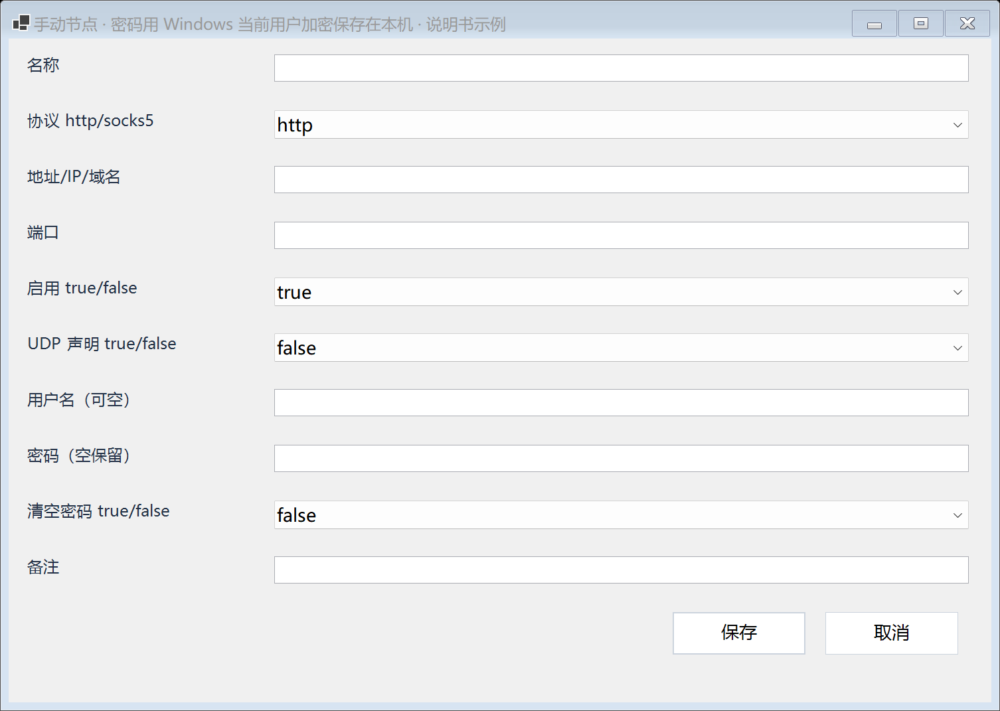

| 字段 | 填写方法 |
|---|---|
| 名称 | 便于辨认的名称，不影响实际地址 |
| 协议 | 按节点提供方资料选择 `http` 或 `socks5`，不要只根据端口猜测 |
| 地址/IP/域名 | 中转服务器地址，与 LOL 目标地址不同 |
| 端口 | 提供方指定的端口；只有 IP 通常不足以连接 |
| 启用 | `true` 启用，`false` 停用 |
| UDP 声明 | 只有明确支持时才选 `true`；声明不代表实测通过 |
| 用户名 / 密码 | 按节点要求填写；不需要认证时可空 |
| 密码（空保留） | 编辑已有节点时留空会保留原密码 |
| 清空密码 | 明确需要删除已有密码时才选 `true` |
| 备注 | 记录用途或来源，避免填写敏感信息 |

保存节点只保存资料，不会自动应用线路。截图中的示例地址不可用于代理。软件和仓库不提供节点；用户自行准备。

## 09 · 测试线路并比较结果

点击 **一键测试全部**，会依次测试启用节点的配置组与大厅组；也可点击各组的 **测试这一组**。某个接口失败，不代表其他接口无需再看。

展开各组下拉框，可查看最近结果、通过次数、最慢接口耗时和测试时间。超过三十分钟显示待复测；节点、目标或网络环境改变后应重新测试。

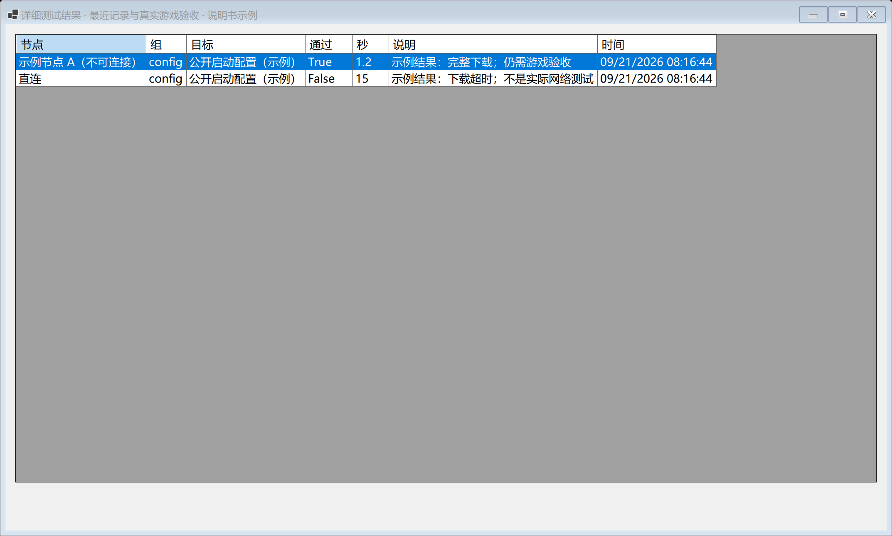

点击 **结果/右键验收** 可查看逐接口详情。重点看“目标”和“说明”，不要只看 `True/False` 或秒数。完整下载、TLS 验证、HTTP 响应和真实对局是不同层级。

**取消测试**停止后续排队测试；当前组可能先完成并清理临时代理，不一定立即退出。示例图里的 1.2 秒和 15 秒不是产品性能指标。

## 10 · 单独分配服务与保存方案

点击 **单独分配**，为某一个目标选择路径。

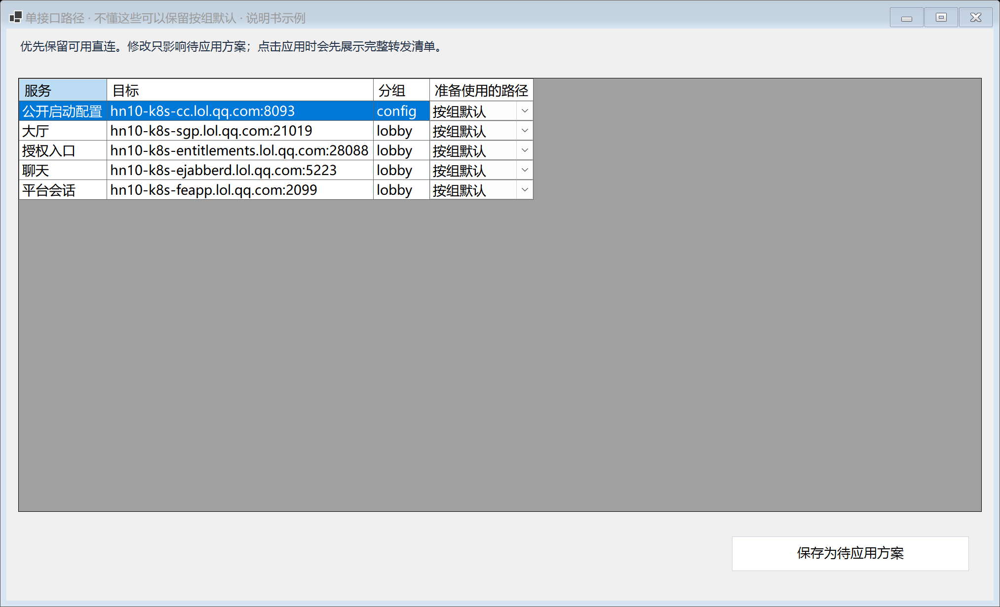

**按组默认**跟随主窗口对应组的选择；其他选项覆盖该目标的组默认路径。例如大厅整体直连，但某个配置接口使用自己的节点。保存后仍是草稿，需要再应用。

主窗口“方案名称”输入名称后点 **保存选择**；下次选择名称再点 **载入方案**。方案包含组选择与单接口覆盖。载入只改变草稿，不会自动生效。

右键 **预览并应用组合** 可以请求基于当前有效测试记录的建议。建议不是最优路径保证；缺少证据的目标需要人工检查。

## 11 · 预览、应用与真实验收

点击 **预览并应用组合**，先核对清单。

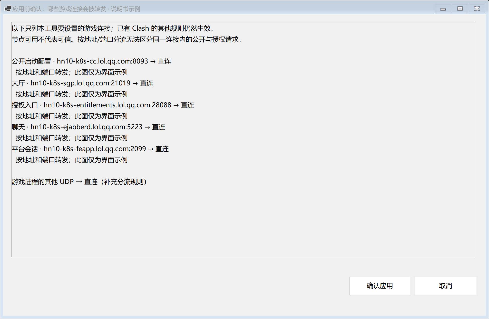

每行列出服务目标及准备使用的节点，底部还列出游戏进程 UDP 补充分流。只有点 **确认应用** 才会尝试更改配置；点 **取消** 不应用。

应用需要已有 Clash/Mihomo、规则模式与 TUN。通常保持“允许运行中切换”不勾选，退出对局后操作。选择“直连”表示对应规则使用 DIRECT，不等于关闭电脑上所有 VPN。

应用完成后重新打开客户端，让游戏建立新连接，再进行一次诊断。右键主窗口 **结果/右键验收** 可以记录“大厅成功”“进入游戏成功”“对局正常/失败”和备注。用户记录用于保存实际体验，不能代替自动证据。

## 12 · 恢复配置与退出

要撤回工具接管的分流，点击高级窗口右下方 **恢复接管前配置**。通常先退出对局，恢复后查看状态提示。

**关闭窗口不等于关闭分流。** 当前已应用规则可能继续保留，不能靠关闭 EXE 来撤销。

如果工具提示订阅或运行规则已变化，不要反复覆盖旧备份。可在 Clash 重新加载自己的订阅，之后刷新本工具状态。恢复针对工具接管的配置，不是恢复系统全部网络设置。

## 13 · 手动维护 LOL 目标

高级窗口点击 **LOL 目标**。当服务器发生变化，或需要增加其他区服目标时使用。

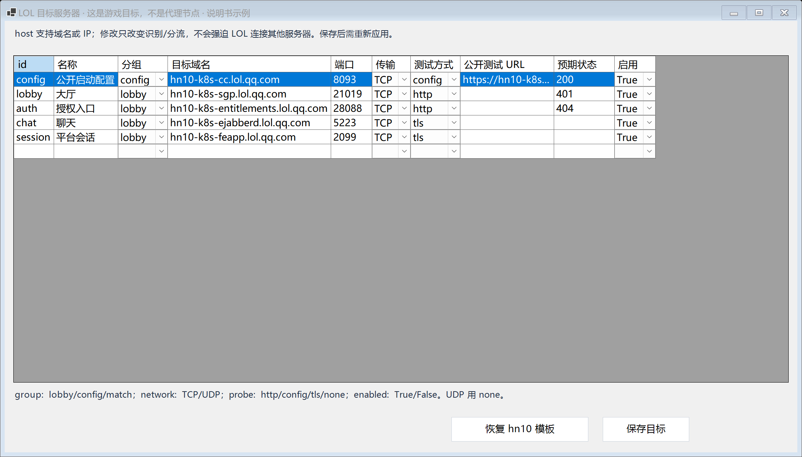

| 字段 | 含义 |
|---|---|
| id / 名称 | 唯一标识 / 可读名称；每条目标需要不同 id |
| 分组 | `lobby` 大厅，`config` 配置，`match` 对局 |
| 目标域名 / 端口 | 游戏真正访问的目的地，可用域名或 IP |
| 传输 | `TCP` 或 `UDP` |
| 测试方式 | `tls` 证书连接，`http` 无认证响应，`config` 配置下载，`none` 不主动探测 |
| 公开测试 URL / 预期状态 | 仅按已确认的无认证接口填写，不粘贴带账号令牌的链接 |
| 启用 | 是否纳入待用目标配置 |

通过底部空白行添加记录，选中整行可删除；完成后点 **保存目标**，之后需要重新测试及应用。UDP 目标使用 `none`，不要用 TCP 测试结果推断 UDP。

**恢复 hn10 模板**会替换目标集，不是自动检测自己的区服。这个模板只是历史参考。优先保留已确认的域名，避免把会变化的 IP 固定死；修改此表不会强迫 LOL 连接另一个服务器。

## 14 · 识别服务器

高级窗口的 **识别服务器** 是补充观察入口。点击后正常启动游戏，观察约四十五秒，结束显示候选地址。

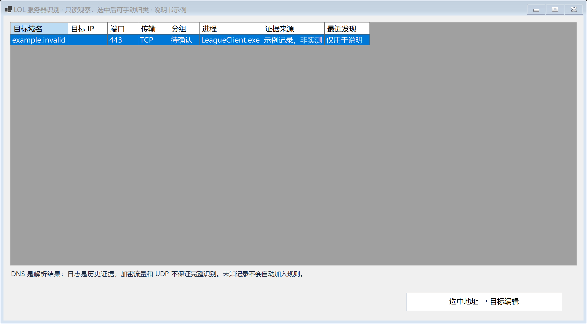

核对来源和时间，选中相关地址后点击 **选中地址 → 目标编辑**，再人工确认用途和协议。这里可能混合当前连接、DNS 与历史日志：解析结果不是连接成功，历史日志也不代表服务仍在使用。

首次使用优先走主窗口的诊断流程；不要把识别列表中的所有地址都加入分流。

## 15 · 本机设置

在高级窗口点击 **设置**。只做基础诊断时，大部分字段可以暂不配置。

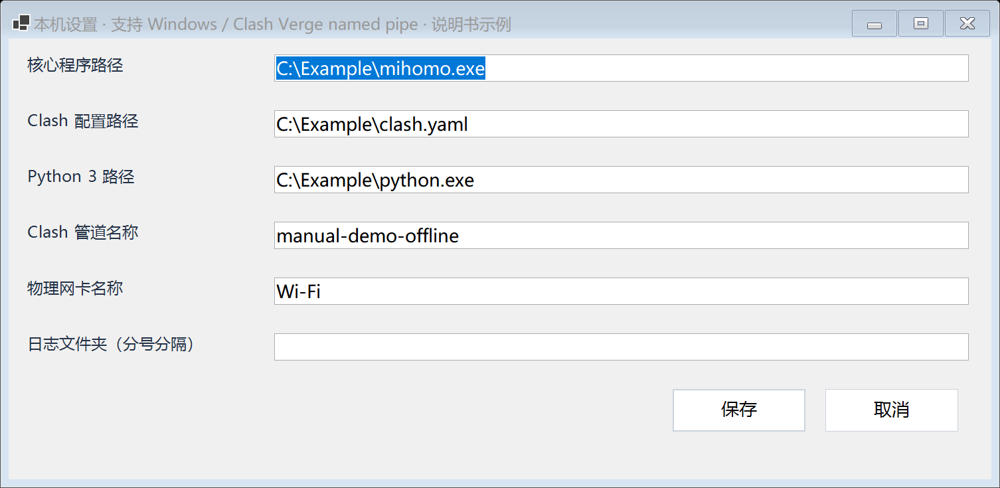

| 设置项 | 用途 |
|---|---|
| 核心程序路径 | 已安装的 Mihomo / verge-mihomo 程序，用于节点测试与配置校验 |
| Clash 配置路径 | 当前需要接管的 YAML 配置，不是节点 IP |
| Python 3 路径 | 主动接口探测使用的 Python 可执行文件 |
| Clash 管道名称 | 连接本机核心控制接口的名称，不是代理节点端口 |
| 物理网卡名称 | 节点测试使用的网卡，例如实际联网的 Wi-Fi |
| 日志文件夹 | 可读取游戏日志的位置，多个路径用分号分隔 |

截图中的 `C:\Example\...` 是占位路径，不能直接照抄。核心程序、配置路径或管道不正确时，先修正这些依赖，不要通过更换目标 IP 掩盖问题。

## 16 · 常见问题速查

| 现象 | 先做什么 |
|---|---|
| EXE 打不开 | 完整解压；确认 PowerShell 7；尝试同目录 Start.cmd |
| 没有节点 | 可以先诊断，不必添加节点 |
| 找不到日志 / 没有证据 | 选择游戏文件夹，正常重现问题并标记阶段；权限或客户端格式可能影响识别 |
| 显示需配置 Python | 基础观察仍可用；只有主动探测需要它 |
| 测试全通过，游戏仍进不去 | 再次启动游戏，检查实际路径、账号流程和未验证项 |
| UDP 显示未验证 | 不是已失败；能力声明不能代替真实对局 |
| 保存或载入方案后没变化 | 它们只改变草稿，还需预览并确认应用 |
| 想关闭加速 / 转发 | 使用恢复接管前配置，不是只关闭窗口 |
| 换热点、区服或节点后旧结果还在 | 重新诊断和测试，旧记录不能代表新环境 |

本地数据默认位于 `%LOCALAPPDATA%\LolRouteLab`，包括节点、设置、诊断及回退备份。请勿把整个目录公开上传；备份配置可能含凭证。对外反馈优先提供脱敏摘要，并说明操作阶段与发生时间。

## 素材与截图索引

本手册的十四张新增截图位于 `docs/assets/manual/`，编号对应操作流程，适合复用在介绍页面。原有真实使用截图保留在 `docs/assets/observe.png` 和 `docs/assets/diagnosis.png`。

展示时保留“示例”说明，不把演示成绩描述为效果实测。详细图注与推荐用途见 [素材索引](ASSETS.md)。
